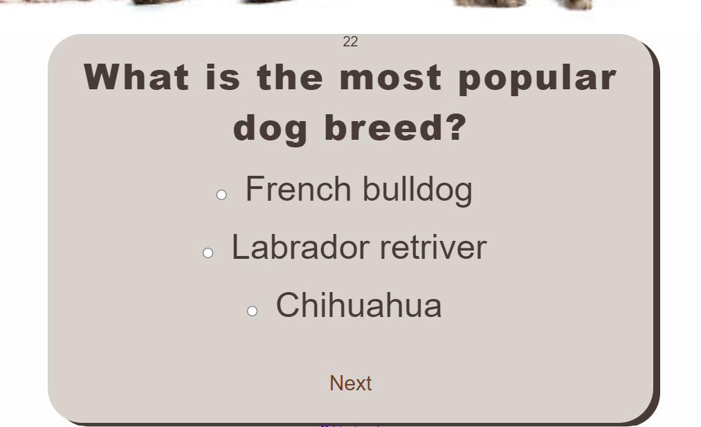

# quiz-project2

This website was designed to test the knowledge of people who enjoy dogs. It starts with a splash page that continues to the quiz on the next page, which includes a timer that counts down from 40 seconds and a score total at the end of the questions. The quiz page also has a hero image with a picture of different dogs.

The home page shows a question and a button to "Start Quiz". The second page contains a header and then a box containing the question and a list of multiple choice questions with radio style buttons. At the top of the quiz is a timer that counts down, adding a little more pressure to answer questions!

This website is the second of five projects that must be completed to earn a Diploma in Software Development from The Code Institute.

Requirements for the project are that the website must be static and responsive with HTML5, CSS3 and JavaScript.
A live version of the site can be found here:
https://hannagfrorer.github.io/Dog-quiz/
 
 ## Table of Contents 
- [UX](#ux "UX")
  - [User Demographic](#user-demographic "User Demographic")
  - [User Goals](#user-goals "User Goals")
  - [Design](#design "Design")
  - [Colour Scheme](#colour-scheme "Colour Scheme")
  - [Typography](#typography "Typography")
  - [Images](#images "Images")
- [Features](#features "Features")
  - [Welcome page and start button](#welcome-page-and-start-button "Welcome page and start button")
  - [Quiz Header](#quiz-header "Quiz Header")
  - [Quiz Section](#quiz-section "Quiz Section")
- [Technologies Used](#technologies-used "Technologies Used")
- [Testing](#testing "Testing")
  - [Validator testing](#validator-testing "Validator Testing")
  - [Testing and bugs](#testing-and-bugs "Testing and bugs")
- [Media](#media "Media")
- [Deployment](#deployment "Deployment")
- [Acknowledgements](#acknowledgements "Acknowledgements")
- [Sources](#sources "Sources")

## UX 

## User Demographic
 This site has been designed for users of all ages to see how much they know about dogs.
 
 ## User Goals
 * To test their knowledge of dogs.
 * To have fun.
 
 ## Design 
As this is my first project with javascript, I have been inspired by: https://jodymurray.github.io/quiz/ and https://lizac9.github.io/project2-bn-horror-film/ and my prodjekt in HTLM and CSS (cooking courses online)
The purpose of this website is to create a good looking website with an appealing color scheme, my colors were chosen to match the images and were made in colors: https://coolors.co/

This website is two pages, Index.html contains a button stating "Start Quiz", which when clicked will take you to the quiz page: quiz.html. The second link is under the quiz page header with "Go back", which will take you back to the start quiz on the home page.

## Colour Scheme
I have chosen the color scale that I have on the website by uploading the image that is doglogo-image-section on the quiz.html page to colors and there created a palette that matches that image.

- I created the palette because I wanted to get an impression of a whole with a soft feel. The colors are a mixture of dark and light in the same tone, which makes it restful for the eyes.

## Typography 
- The fonts used for this project were from https://fonts.google.com/
- Icons for the leaves in the header are from https://fontawesome.com/
- The fonts used for the Welcome page and the Quiz page: <link href="https://fonts.googleapis.com/css2?family=Nunito+Sans:wght@300&display=swap" rel="stylesheet">
## Images 
The images have been selected according to the question topic The purpose of the website is to give a soft look and express joy. Images have been resized to match design and texture.
## Features
- Welcome page and start button
 - Quiz Header
 - Quiz Section

# Welcome page and start button
- The start page consists of the question: Are you a dog person? As well as a button with the text "Begin quiz", which takes you to the quiz page.
- The picture on the home page is a dog with big flapping ears taken from: https://www.istockphoto.com/se

# Quiz Header
- The title of the quiz contains the question How much do you know about dogs? Take this quiz and you'll see, t. It also has a "Go back" button and a paw on the left side.

- The picture on the quiz page is a picture with 6 different dogs standing, sitting and lying down, they also look in different directions and are taken from: https://www.istockphoto.com/se

# Quiz Section
- The quiz section is a light-coloured box with the question, a timer, three possible answers to each question and radio buttons to mark the answers.
- It also features a next button which takes you to the next question.

- The end of the quiz shows us the amount of questions we answered correctly out of 6 questions. And it also includes a 'Reload' button which will bring you to the first question again and it will reset the timer for you to try the quiz again! 

# Technologies Used 
- HTML
- CSS
- JavaScript

# Testing 

## Validator testing 
- HTML
  - No errors were found using W3C HTML validator testing.

- CSS
  - No errors were found using W3C CSS validator testing.

- JavaScript 
  - No errors were found using jShint validator testing.

## Lighthouse testing

## Testing and Bugs
Tests have been conducted using Google Chrome, testing different devices and screen resolutions through google dev tools.
The following is the bugs I came across:

1. The next button was not centered as I wanted.
 - Solution; change padding in button and change padding, width and margin in quiz-section.
2.The Timer on the Quiz page carries on to finish and then says "Done" and doesn't reset automatically. 
 -  Solution; The timer resets once the 'Reload' button is clicked.
3. The font awsom don't work on the quiz-page.
-solution; Add the script of fontawsom in the head of the quiz.html.
4. The next button is visible below the relod button without any function.
-solution; moved the next button in to the div.

# Deployment 
The development platform used for this project was GitPod. To track the development stage and handle version control regular commits and pushes to GitHub has been conducted. The GitPod environment was created using a template provided by Code Institute.

The live version of the project is deployed at GitHub pages.

The procedure for deployment followed the "Creating your site" steps provided in GitHub Docs.

*Log into Github.
*Select the correct GitHub Repository to be deployed live.
*Underneath the repository name, click the “Settings” option.
*In the sub-section list on the left, under “Code and automation”, click “Pages”.
*Within the ”Source” section choose ”main” as Branch and root as folder and click ”Save”.
*The page refreshes and a website shall then deploy via a link.

The live deployed link can be found here - 
https://hannagfrorer.github.io/Dog-quiz/

# Media

- 

- the image on the start page:https://www.istockphoto.com/es/foto/batiendo-los-o%C3%ADdos-gm93610309-7188469?phrase=dogs%20big%20ear
- the image on the quiz page: https://www.istockphoto.com/es/foto/grupo-de-seis-perros-gm1175747279-327534351?phrase=dogs
# Acknowledgements
For inspiration, for code, design help and advice, I'd like to thank;

Martina Terlevic
- My wonderful mentor at Code Institute.

The Code Institute.

# Sources
Sites that provided me with helpful information and resolved many of my issues;
https://www.w3schools.com/
https://stackoverflow.com/
https://youtube.com/

The top screen shot for responsive design was taken from: 
- https://ui.dev/amiresponsive

Thank you

[Back to top](#quiz-project2)